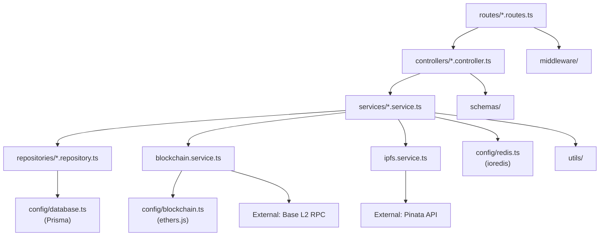

# 📁 Backend Structure

> **Phygital-Trace** | Annotated folder tree, dependency diagrams, and module explanations

---

## 📖 Table of Contents

1. [Directory Tree](#1-directory-tree)
2. [Module Dependency Diagram](#2-module-dependency-diagram)
3. [Layer Architecture](#3-layer-architecture)
4. [Key File Explanations](#4-key-file-explanations)
5. [Naming Conventions](#5-naming-conventions)
6. [Adding New Features](#6-adding-new-features)

---

## 1. Directory Tree

```
backend/
├── src/
│   ├── app.ts                    # Express app setup — middlewares, route mounting
│   ├── main.ts                   # Entry point — server listen, graceful shutdown
│   │
│   ├── config/
│   │   ├── index.ts              # Central config object (reads process.env)
│   │   ├── database.ts           # Prisma client singleton
│   │   ├── redis.ts              # ioredis client singleton
│   │   └── blockchain.ts         # ethers.js provider + contract instances
│   │
│   ├── routes/
│   │   ├── index.ts              # Route aggregator
│   │   ├── auth.routes.ts        # /v1/auth/*
│   │   ├── certificate.routes.ts # /v1/certificates/*
│   │   ├── verify.routes.ts      # /v1/verify/*
│   │   ├── profile.routes.ts     # /v1/profiles/*
│   │   ├── webhook.routes.ts     # /v1/webhooks/*
│   │   └── admin.routes.ts       # /v1/admin/*
│   │
│   ├── controllers/
│   │   ├── auth.controller.ts
│   │   ├── certificate.controller.ts
│   │   ├── verify.controller.ts
│   │   ├── profile.controller.ts
│   │   ├── webhook.controller.ts
│   │   └── admin.controller.ts
│   │
│   ├── services/
│   │   ├── auth.service.ts       # Registration, login, JWT management
│   │   ├── certificate.service.ts# Main issuance orchestration (saga pattern)
│   │   ├── verify.service.ts     # Certificate lookup + cross-validation
│   │   ├── ipfs.service.ts       # Pinata IPFS operations
│   │   ├── blockchain.service.ts # ethers.js contract interactions
│   │   ├── email.service.ts      # Transactional email (Resend)
│   │   ├── webhook.service.ts    # Webhook delivery + retry
│   │   └── profile.service.ts    # Journalist profile management
│   │
│   ├── repositories/
│   │   ├── certificate.repository.ts # Certificate CRUD + queries
│   │   ├── user.repository.ts        # User CRUD + queries
│   │   ├── webhook.repository.ts     # Webhook config CRUD
│   │   └── audit-log.repository.ts   # Append-only audit log
│   │
│   ├── middleware/
│   │   ├── auth.middleware.ts    # JWT validation (requireAuth, optionalAuth)
│   │   ├── validate.middleware.ts# Zod schema validation
│   │   ├── rate-limit.middleware.ts # Redis-backed rate limiting
│   │   ├── error-handler.ts     # Global error handler (must be last)
│   │   ├── request-id.ts        # Assign unique requestId per request
│   │   └── upload.middleware.ts  # Multer config for image uploads
│   │
│   ├── schemas/
│   │   ├── auth.schema.ts        # Zod schemas for auth endpoints
│   │   ├── certificate.schema.ts # Zod schemas for certificate endpoints
│   │   ├── verify.schema.ts      # Zod schemas for verification endpoints
│   │   └── profile.schema.ts     # Zod schemas for profile endpoints
│   │
│   ├── blockchain/
│   │   ├── abis/
│   │   │   ├── TruthCertificate.json  # ABI for main contract
│   │   │   └── PhygitalNFT.json       # ABI for NFT contract
│   │   ├── events/
│   │   │   └── certificate-listener.ts # Listens for blockchain events
│   │   └── utils/
│   │       └── gas.utils.ts           # Gas estimation helpers
│   │
│   ├── utils/
│   │   ├── hash.utils.ts         # SHA-256 computations for image + sensor
│   │   ├── signature.utils.ts    # Secure Enclave sig verification (ECDSA/P-256)
│   │   ├── pagination.utils.ts   # Cursor/offset pagination helpers
│   │   ├── retry.utils.ts        # Exponential backoff retry
│   │   ├── logger.ts             # Pino logger singleton
│   │   ├── cache.utils.ts        # Redis cache wrapper
│   │   └── id.utils.ts           # ULID-based ID generation
│   │
│   ├── types/
│   │   ├── express.d.ts          # Express Request augmentation (req.user, req.id)
│   │   ├── certificate.types.ts  # Certificate domain types
│   │   ├── sensor.types.ts       # Sensor bundle types
│   │   └── errors.types.ts       # AppError base class + subclasses
│   │
│   └── __tests__/
│       ├── unit/
│       │   ├── certificate.service.test.ts
│       │   ├── verify.service.test.ts
│       │   ├── ipfs.service.test.ts
│       │   ├── blockchain.service.test.ts
│       │   └── hash.utils.test.ts
│       ├── integration/
│       │   ├── certificates.routes.test.ts
│       │   ├── verify.routes.test.ts
│       │   └── auth.routes.test.ts
│       └── helpers/
│           ├── factories.ts       # Mock data factories
│           └── setup.ts           # Jest setup (db, redis, mocks)
│
├── prisma/
│   ├── schema.prisma             # Database schema (source of truth)
│   ├── migrations/               # Auto-generated migration history
│   │   ├── 20260101000000_init/
│   │   └── 20260215000000_add_revocation/
│   └── seed.ts                   # Development seed data
│
├── scripts/
│   ├── migrate-prod.sh           # Safe production migration script
│   └── blockchain-sync.ts        # Re-sync DB from blockchain events
│
├── package.json
├── tsconfig.json
├── .env.example
└── jest.config.ts
```

---

## 2. Module Dependency Diagram



```
DEPENDENCY FLOW (simplified):
─────────────────────────────
main.ts
  └── app.ts
        ├── middleware/ (auth, rate-limit, validate)
        └── routes/
              └── controllers/
                    └── services/
                          ├── repositories/ ──→ Prisma (PostgreSQL)
                          ├── ipfs.service ──→ Pinata API
                          ├── blockchain.service → Base L2 RPC
                          └── utils/ ──→ (pure functions, no deps)
```

---

## 3. Layer Architecture

```
┌──────────────────────────────────────────────┐
│              ROUTES LAYER                    │
│  Define HTTP method, path, middleware chain  │
│  e.g.: router.post("/", certRateLimit,       │
│         requireAuth, validate(schema),       │
│         certController.create)               │
└──────────────────────────┬───────────────────┘
                           │
┌──────────────────────────▼───────────────────┐
│            CONTROLLER LAYER                  │
│  Parse request, call service, format HTTP    │
│  response. No business logic here.           │
│  e.g.: const cert = await certService        │
│         .register(req.body);                 │
│         return res.status(201).json(cert)    │
└──────────────────────────┬───────────────────┘
                           │
┌──────────────────────────▼───────────────────┐
│             SERVICE LAYER                    │
│  All business logic lives here.              │
│  Orchestrates repositories + external APIs.  │
│  Enforces invariants and transaction safety. │
└──────────────────────────┬───────────────────┘
                           │
         ┌─────────────────┼───────────────────┐
         │                 │                   │
┌────────▼───────┐  ┌──────▼──────┐  ┌────────▼───────┐
│ REPOSITORY     │  │  IPFS       │  │  BLOCKCHAIN    │
│ LAYER          │  │  SERVICE    │  │  SERVICE       │
│ Prisma ORM     │  │  Pinata API │  │  ethers.js     │
│ PostgreSQL     │  │             │  │  Base L2 RPC   │
└────────────────┘  └─────────────┘  └────────────────┘
```

---

## 4. Key File Explanations

### `src/app.ts`

The Express application factory. Does **not** call `listen()` — that is in `main.ts`.

```typescript
export function createApp(): Express {
  const app = express();
  applyMiddleware(app);
  applyRoutes(app);
  applyErrorHandlers(app);
  return app;
}
```

### `src/config/index.ts`

Reads and validates all environment variables at startup. Crashes if required vars are missing.

```typescript
export const config = {
  port: parseInt(process.env.PORT ?? "3001"),
  databaseUrl: requireEnv("DATABASE_URL"),
  redisUrl: requireEnv("REDIS_URL"),
  jwtSecret: requireEnv("JWT_SECRET"),
  blockchain: {
    rpcUrl: requireEnv("RPC_URL"),
    privateKey: requireEnv("PRIVATE_KEY"),
    contractAddress: requireEnv("CONTRACT_ADDRESS"),
    chainId: parseInt(requireEnv("CHAIN_ID")),
  },
  ipfs: {
    apiKey: requireEnv("PINATA_API_KEY"),
    apiSecret: requireEnv("PINATA_API_SECRET"),
    gateway: process.env.PINATA_GATEWAY ?? "https://gateway.pinata.cloud",
  },
};
```

### `src/services/certificate.service.ts`

The most critical file. Implements the issuance saga:
1. Validate inputs (signature, sensor completeness)
2. Check for duplicate image hash
3. Create DB record (status: `pending`)
4. Pin payload to IPFS
5. Submit blockchain transaction
6. Update DB record to `confirmed`
7. Trigger webhooks (async, non-blocking)

### `src/blockchain/events/certificate-listener.ts`

A background process that watches for `CertificateRegistered` and `CertificateRevoked` events from the smart contract and syncs them to the database. This ensures the DB stays in sync even if a certificate was registered directly on-chain.

### `src/utils/hash.utils.ts`

Pure functions for all hash computations. These are the **canonical** implementations — the mobile app and web portal must produce identical hashes using the same algorithm.

```typescript
// SHA-256 of image buffer
export async function computeImageHash(buffer: Buffer): Promise<string>

// SHA-256 of canonically serialized sensor JSON
export function computeSensorHash(bundle: SensorBundle): string

// SHA-256(imageHash_bytes || sensorHash_bytes)
export function computeCombinedHash(imageHash: string, sensorHash: string): string
```

---

## 5. Naming Conventions

| File Type | Convention | Example |
|---|---|---|
| Route file | `<resource>.routes.ts` | `certificate.routes.ts` |
| Controller | `<resource>.controller.ts` | `certificate.controller.ts` |
| Service | `<resource>.service.ts` | `certificate.service.ts` |
| Repository | `<resource>.repository.ts` | `certificate.repository.ts` |
| Middleware | `<name>.middleware.ts` | `auth.middleware.ts` |
| Schema | `<resource>.schema.ts` | `certificate.schema.ts` |
| Types | `<domain>.types.ts` | `sensor.types.ts` |
| Utils | `<concern>.utils.ts` | `hash.utils.ts` |
| Tests | `<target>.test.ts` | `certificate.service.test.ts` |

---

## 6. Adding New Features

### Checklist for a New API Resource

```
□ Define types in src/types/<resource>.types.ts
□ Define Zod schema in src/schemas/<resource>.schema.ts
□ Create Prisma model in prisma/schema.prisma
□ Run npx prisma migrate dev --name add_<resource>
□ Create repository in src/repositories/<resource>.repository.ts
□ Create service in src/services/<resource>.service.ts
□ Create controller in src/controllers/<resource>.controller.ts
□ Create routes in src/routes/<resource>.routes.ts
□ Mount routes in src/routes/index.ts
□ Write unit tests in src/__tests__/unit/<resource>.service.test.ts
□ Write integration tests in src/__tests__/integration/<resource>.routes.test.ts
□ Update OpenAPI spec (if separate)
□ Update BACKEND.md documentation
```

---

*Last Updated: 2026-03-08*
