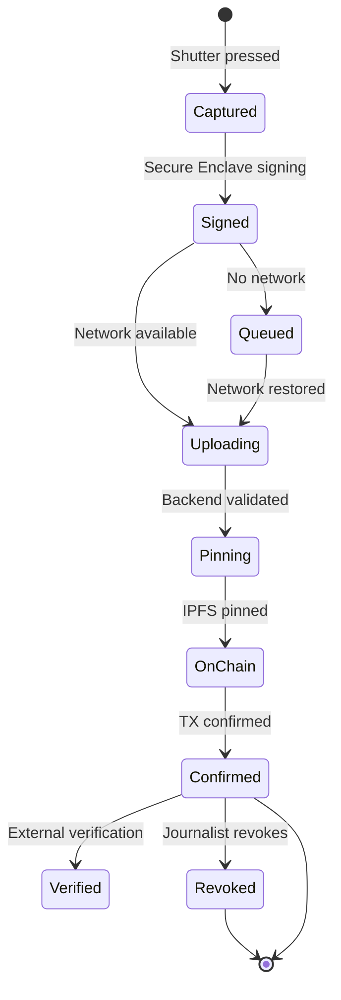
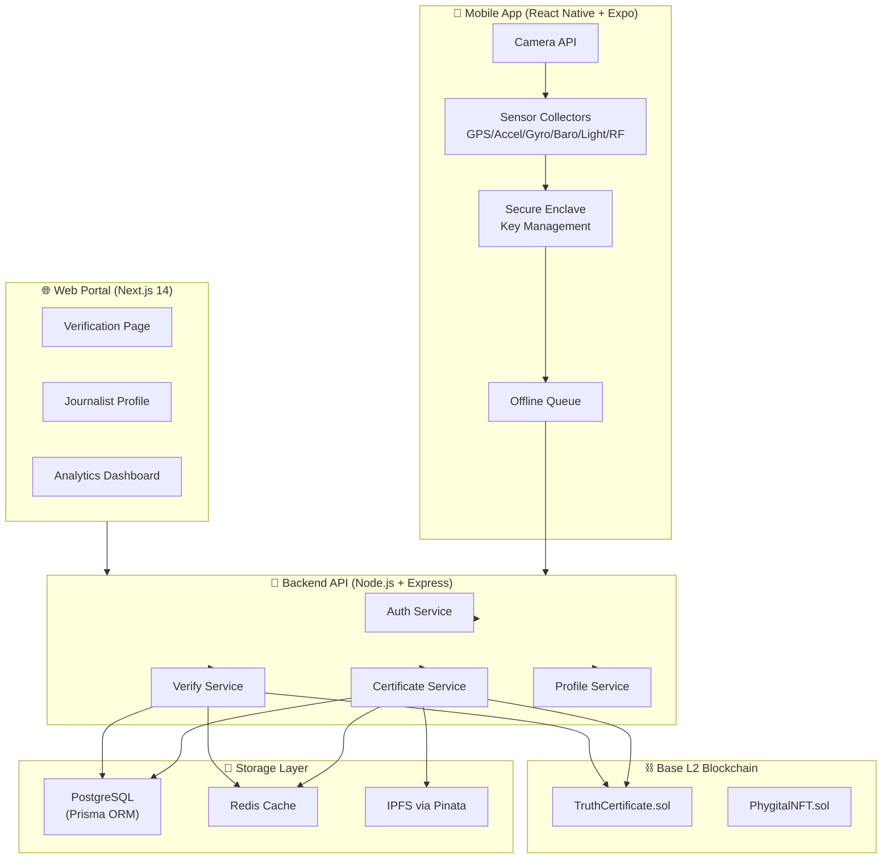
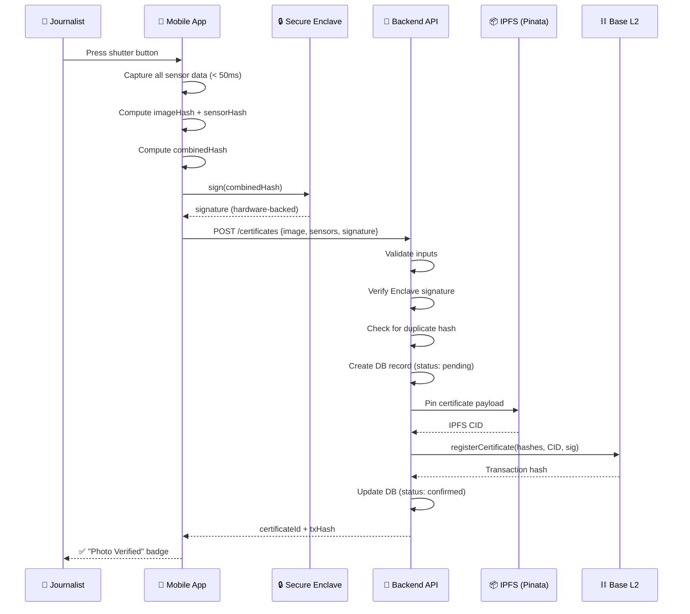
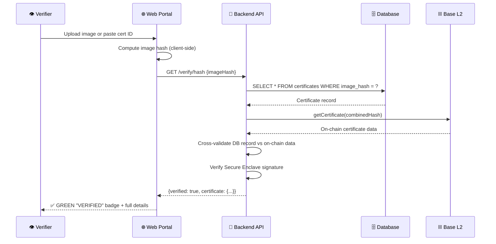
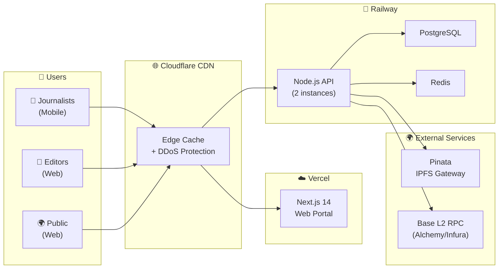

# 🏗️ System Design Document

> **Phygital-Trace** | Comprehensive System Architecture, Diagrams & Scalability

[](./SYSTEM_DESIGN.md)
[](./SYSTEM_DESIGN.md)

---

## 📖 Table of Contents

1. [Design Goals](#1-design-goals)
2. [High-Level Architecture](#2-high-level-architecture)
3. [Trust Boundaries](#3-trust-boundaries)
4. [Component Deep Dives](#4-component-deep-dives)
5. [Data Flow Diagrams](#5-data-flow-diagrams)
6. [Mermaid Architecture Diagrams](#6-mermaid-architecture-diagrams)
7. [Scalability Strategy](#7-scalability-strategy)
8. [Caching Strategy](#8-caching-strategy)
9. [Disaster Recovery](#9-disaster-recovery)
10. [Network & Topology](#10-network--topology)
11. [Observability & Monitoring](#11-observability--monitoring)
12. [Capacity Planning](#12-capacity-planning)

---

## 1. Design Goals

### 1.1 Core Design Principles

| Principle | Rationale |
|---|---|
| **Tamper Evidence** | Every certificate must be cryptographically impossible to forge retroactively |
| **Physical World Binding** | Certificates must reference real-world physical state (not reconstructable in software) |
| **Permissionless Verification** | Anyone must be able to verify any certificate without trusting Phygital-Trace |
| **Offline Resilience** | The mobile app must function without internet; certificates queue for later upload |
| **Defense in Depth** | No single vulnerability should compromise the system's core guarantees |
| **Minimum Viable Trust** | The system requires trusting only: Base L2 consensus and the phone's hardware |

### 1.2 CAP Theorem Positioning

| System Component | C | A | P | Trade-off Decision |
|---|---|---|---|---|
| Blockchain (Base L2) | ✅ | ⚠️ | ✅ | Consistency over availability: never serve wrong certificate data |
| PostgreSQL | ✅ | ⚠️ | ✅ | Consistency: duplicate certificates are a critical failure |
| Redis cache | ⚠️ | ✅ | ✅ | Availability: stale cache is acceptable, wrong blockchain data is not |
| IPFS | ⚠️ | ✅ | ✅ | Availability: content-addressed storage is eventually consistent |

### 1.3 Non-Goals

- This system does **not** determine whether an image's *subject* is true (only that the image is unmodified)
- This system does **not** prevent journalists from capturing staged scenes
- This system does **not** replace journalistic editorial judgment

---

## 2. High-Level Architecture

### 2.1 System Context Diagram

```
╔══════════════════════════════════════════════════════════════════════════╗
║                        PHYGITAL-TRACE SYSTEM                            ║
║                                                                          ║
║   ┌─────────────┐         ┌──────────────────────────────────────────┐  ║
║   │             │ HTTPS   │                                          │  ║
║   │  📱 Mobile  │ ──────> │      🔧 Backend API (Node.js)            │  ║
║   │  App        │         │                                          │  ║
║   │  (Expo RN)  │         │  ┌──────────┐  ┌──────────┐             │  ║
║   └─────────────┘         │  │  Auth    │  │  Certs   │             │  ║
║                            │  │  Service │  │  Service │             │  ║
║   ┌─────────────┐         │  └──────────┘  └──────────┘             │  ║
║   │             │ HTTPS   │                                          │  ║
║   │  🌐 Web     │ ──────> │  ┌──────────┐  ┌──────────┐             │  ║
║   │  Portal     │         │  │  Verify  │  │  Profile │             │  ║
║   │  (Next.js)  │         │  │  Service │  │  Service │             │  ║
║   └─────────────┘         │  └──────────┘  └──────────┘             │  ║
║                            └──────────────────────┬───────────────────┘  ║
║   ┌─────────────┐                                 │                     ║
║   │ 3rd Party   │ REST API                         │                     ║
║   │ Integrations│ ──────────────────────────────── │                     ║
║   └─────────────┘                                 │                     ║
║                                        ┌──────────▼────────────────────┐ ║
║                                        │      INFRASTRUCTURE LAYER     │ ║
║                                        │                               │ ║
║                                        │  PostgreSQL  Redis  Pinata    │ ║
║                                        │      ↕          ↕      ↕      │ ║
║                                        │  Base L2 ◄──────────────┘     │ ║
║                                        └───────────────────────────────┘ ║
╚══════════════════════════════════════════════════════════════════════════╝
```

---

## 3. Trust Boundaries

### 3.1 ASCII Trust Boundary Diagram

```
╔═════════════════════════════════════════════════════════════════════════════╗
║  TRUST ZONE 1: HARDWARE (Highest Trust)                                    ║
║  ┌─────────────────────────────────────────────────────────────────────┐   ║
║  │  Secure Enclave (Apple SEP / Android StrongBox)                     │   ║
║  │  • Keys generated in hardware, never exported                       │   ║
║  │  • Signing requires biometric authentication                        │   ║
║  │  • Cannot be accessed by OS or apps directly                        │   ║
║  └─────────────────────────────────────────────────────────────────────┘   ║
╠═════════════════════════════════════════════════════════════════════════════╣
║  TRUST ZONE 2: DEVICE (High Trust)                                         ║
║  ┌─────────────────────────────────────────────────────────────────────┐   ║
║  │  Phygital-Trace Mobile App                                          │   ║
║  │  • Code-signed by Apple/Google developer account                   │   ║
║  │  • Sensor APIs accessed through official OS SDK                    │   ║
║  │  • All computation happens before data leaves device                │   ║
║  └─────────────────────────────────────────────────────────────────────┘   ║
╠═════════════════════════════════════════════════════════════════════════════╣
║  TRUST ZONE 3: TRANSPORT (Medium Trust - Mitigated by TLS + Cert Pinning)  ║
║  ┌─────────────────────────────────────────────────────────────────────┐   ║
║  │  HTTPS / TLS 1.3                                                    │   ║
║  │  • Certificate pinning prevents MITM                               │   ║
║  │  • All data signed before leaving device                           │   ║
║  └─────────────────────────────────────────────────────────────────────┘   ║
╠═════════════════════════════════════════════════════════════════════════════╣
║  TRUST ZONE 4: SERVER (Medium Trust - Verified by Blockchain)              ║
║  ┌─────────────────────────────────────────────────────────────────────┐   ║
║  │  Phygital-Trace Backend API                                         │   ║
║  │  • Hosted by Phygital-Trace (semi-trusted)                         │   ║
║  │  • Database can be verified against blockchain                     │   ║
║  │  • Cannot forge certificates (doesn't have Secure Enclave keys)    │   ║
║  └─────────────────────────────────────────────────────────────────────┘   ║
╠═════════════════════════════════════════════════════════════════════════════╣
║  TRUST ZONE 5: BLOCKCHAIN (Highest Verifiability - Trustless)              ║
║  ┌─────────────────────────────────────────────────────────────────────┐   ║
║  │  Base L2 Blockchain                                                 │   ║
║  │  • Immutable ledger (cannot be modified by Phygital-Trace)         │   ║
║  │  • Anyone can read and independently verify                        │   ║
║  │  • Secured by Ethereum L1 consensus                               │   ║
║  └─────────────────────────────────────────────────────────────────────┘   ║
╚═════════════════════════════════════════════════════════════════════════════╝
```

### 3.2 Threat at Each Boundary

| Boundary | Attack Vector | Mitigation |
|---|---|---|
| Zone 1→2 | Secure Enclave side-channel | OS security updates; hardware attestation |
| Zone 2 | Jailbreak/root + app bypass | Device attestation (DeviceCheck/SafetyNet) |
| Zone 2→3 | Fake sensor data injection | Enclave signs hash before leaving device |
| Zone 3 | MITM | TLS 1.3 + certificate pinning |
| Zone 4 | DB manipulation | Blockchain is ground truth; DB is cache |
| Zone 4→5 | Malicious server sends wrong hash | Signature verification on-chain |
| Zone 5 | 51% attack on Base L2 | Base inherits Ethereum security |

---

## 4. Component Deep Dives

### 4.1 Sensor Capture Subsystem

```
Shutter Button Press (T=0ms)
         │
         ├──[T+0ms]──  GPS snapshot (latitude, longitude, altitude, accuracy)
         ├──[T+0ms]──  Accelerometer burst (100 samples at 100Hz = 1 second window)
         ├──[T+0ms]──  Gyroscope burst (100 samples at 100Hz)
         ├──[T+0ms]──  Barometric pressure
         ├──[T+0ms]──  Ambient light sensor
         ├──[T+0ms]──  WiFi scan (passive, BSSID + RSSI list)
         ├──[T+0ms]──  Cell tower list (MCC, MNC, LAC, CID)
         └──[T+0ms]──  Camera shutter fires
                │
         [T+10ms]  All sensors collected
                │
         [T+15ms]  JSON serialized (canonical order)
                │
         [T+20ms]  SHA-256 computed: sensorHash
                │
         [T+25ms]  SHA-256 computed: imageHash
                │
         [T+30ms]  combinedHash = SHA-256(imageHash || sensorHash)
                │
         [T+40ms]  Secure Enclave signs combinedHash (biometric already cleared)
                │
         [T+50ms]  Pending certificate ready for upload
```

### 4.2 Certificate Issuance Pipeline

```
Mobile App                Backend API               IPFS          Base L2
─────────────────────────────────────────────────────────────────────────
[1] Send certificate data
    POST /certificates
    { image, sensors, sig }
                           [2] Validate inputs
                           [3] Verify Enclave sig
                           [4] Check for duplicates
                           [5] Create DB record (pending)
                                                    [6] Pin to IPFS
                                                    ← CID returned
                                                                   [7] Register TX
                                                                   ← TX hash returned
                           [8] Update DB (confirmed)
← certificateId returned
[9] Show "Verified" UI
```

### 4.3 Web Verification Pipeline

```
Browser                  Next.js             Backend API        Blockchain
─────────────────────────────────────────────────────────────────────────
[1] User uploads image
[2] SHA-256 computed
    (client-side via
    SubtleCrypto API)
                         [3] GET /verify
                             { hash }
                                              [4] DB lookup by hash
                                              [5] Get IPFS data (cached)
                                              [6] Verify on-chain
                                              ← on-chain record
                                              [7] Cross-validate
                         [8] Return result
[9] Show verdict UI
```

---

## 5. Data Flow Diagrams

### 5.1 Complete Certificate Lifecycle



### 5.2 Data Transformation Flow

```
RAW IMAGE (JPEG/HEIC)
        │
        ▼
SHA-256 hash ──────────────────────────────── imageHash (bytes32)
        │
        ▼
IPFS (optional if user opts-in for image storage)


SENSOR READINGS (raw JSON)
        │
        ▼
Canonical JSON serialization
        │
        ▼
SHA-256 hash ──────────────────────────────── sensorHash (bytes32)
        │
        ▼
TRUNCATED LOCATION (3 decimal places)

                    imageHash + sensorHash
                           │
                           ▼
              SHA-256(imageHash || sensorHash) ── combinedHash (bytes32)
                           │
                           ▼
              Secure Enclave signs combinedHash ── signature (bytes)


IPFS CERTIFICATE PAYLOAD:
{
  imageHash,
  sensorHash,
  combinedHash,
  captureTimestamp,
  locationApprox,
  sensorFingerprint,
  signature,
  publicKey
}
        │
        ▼
Pinata pins to IPFS ────────────────────────── CID (QmXoypiz...)
        │
        ▼
TruthCertificate.registerCertificate(
  imageHash, sensorHash, CID, signature
) ─────────────────────────────────────────── TX Hash (0x...)
```

---

## 6. Mermaid Architecture Diagrams

### 6.1 System Component Diagram



### 6.2 Certificate Issuance Sequence



### 6.3 Verification Sequence



### 6.4 Deployment Topology



---

## 7. Scalability Strategy

### 7.1 Horizontal Scaling Architecture

```
                         Load Balancer (Nginx / Cloudflare)
                                    │
              ┌─────────────────────┼─────────────────────┐
              │                     │                     │
         API Instance 1       API Instance 2       API Instance 3
              │                     │                     │
              └─────────────────────┼─────────────────────┘
                                    │
              ┌─────────────────────┼─────────────────────┐
              │                                           │
     PostgreSQL (Primary)                          Redis Cluster
         │       │                                     │
    Read        Write                          Session  Rate   Cache
   Replica 1   Primary                         Store   Limit
   Replica 2
```

### 7.2 Scaling Triggers

| Metric | Scale Out Trigger | Scale In Trigger |
|---|---|---|
| API CPU usage | > 70% for 5 minutes | < 30% for 15 minutes |
| API memory | > 80% | < 50% |
| Request queue depth | > 1000 | < 100 |
| DB connections | > 80% pool used | < 40% |
| Redis memory | > 75% | < 50% |

### 7.3 Database Scaling Strategy

#### Read Replica for Verification

```sql
-- Verification queries go to read replicas
-- Certificate issuance goes to primary

-- Read replica config in Prisma
datasource db {
  provider = "postgresql"
  url      = env("DATABASE_URL")       // Primary (read/write)
  directUrl = env("DATABASE_READ_URL") // Read replica
}
```

#### Partitioning Strategy for Large Scale

```sql
-- Partition certificates table by creation month
CREATE TABLE certificates (
  id            TEXT NOT NULL,
  image_hash    TEXT NOT NULL,
  created_at    TIMESTAMPTZ NOT NULL,
  ...
) PARTITION BY RANGE (created_at);

CREATE TABLE certificates_2026_q1
  PARTITION OF certificates
  FOR VALUES FROM ('2026-01-01') TO ('2026-04-01');

CREATE TABLE certificates_2026_q2
  PARTITION OF certificates
  FOR VALUES FROM ('2026-04-01') TO ('2026-07-01');
```

### 7.4 IPFS Scalability

```
Level 1: Pinata Professional gateway (< 100K certificates/month)
Level 2: Pinata Enterprise + custom gateway (< 1M certificates/month)
Level 3: Self-hosted IPFS cluster + Pinata backup (> 1M certificates/month)
```

---

## 8. Caching Strategy

### 8.1 Cache Layers

| Cache Layer | Technology | TTL | Purpose |
|---|---|---|---|
| CDN Edge | Cloudflare | 5 min | Static assets, public verification pages |
| Application | Redis | 1 hour | Certificate lookups, user profiles |
| DB Connection Pool | PgBouncer | Session | Reduce DB connection overhead |
| Client-side | HTTP Cache | 1 hour | Browser caching for verification results |

### 8.2 Cache Key Design

```typescript
// Certificate lookup
const certKey = `cert:hash:${imageHash}`;          // TTL: 1 hour
const certIdKey = `cert:id:${certificateId}`;      // TTL: 1 hour

// User profile
const profileKey = `profile:${userId}`;            // TTL: 5 minutes

// Rate limiting
const rateLimitKey = `ratelimit:${userId}:${window}`;  // TTL: 1 minute

// Blockchain data (longer TTL - immutable)
const chainKey = `chain:cert:${combinedHash}`;     // TTL: 24 hours
```

### 8.3 Cache Invalidation

```typescript
// Certificate update invalidates relevant caches
async function invalidateCertificateCache(cert: Certificate) {
  await Promise.all([
    redis.del(`cert:hash:${cert.imageHash}`),
    redis.del(`cert:id:${cert.id}`),
    redis.del(`profile:${cert.userId}`), // Profile cert count
  ]);
}
```

---

## 9. Disaster Recovery

### 9.1 Recovery Objectives

| Scenario | RTO | RPO | Strategy |
|---|---|---|---|
| Single API instance failure | < 30 seconds | 0 | Auto-restart + load balancer health checks |
| Database primary failure | < 5 minutes | < 1 minute | Automatic failover to standby |
| Full region failure | < 1 hour | < 15 minutes | Manual failover to secondary region |
| IPFS gateway outage | < 10 minutes | 0 | Switch to backup Pinata gateway |
| Blockchain RPC outage | < 5 minutes | 0 | Switch to backup RPC provider |
| Complete backend outage | < 1 hour | < 15 minutes | Restore from backup, verify blockchain |

### 9.2 Backup Strategy

```
PostgreSQL Backups:
├── Continuous WAL archiving (S3) — Point-in-time recovery
├── Daily full backups (S3) — 30-day retention
├── Weekly backups (S3 Glacier) — 1-year retention
└── Monthly backups (offline) — 7-year retention (compliance)

Redis Backups:
├── RDB snapshot every 1 hour
└── AOF persistence enabled

IPFS Content:
└── Content-addressed — any pin recovery restores full content
    └── Phygital-Trace maintains backup pins on 2 gateways
```

### 9.3 Blockchain as Recovery Ground Truth

> ⚠️ **Key Design Insight:** Even if the entire Phygital-Trace backend is destroyed, certificates can be recovered from the blockchain + IPFS.

```
Recovery Procedure if DB is lost:
1. Read all CertificateRegistered events from TruthCertificate.sol
2. For each event, fetch IPFS payload by CID
3. Reconstruct certificate records from blockchain events + IPFS data
4. Rebuild PostgreSQL database from this data
5. Estimated recovery time: < 4 hours for 1M certificates
```

---

## 10. Network & Topology

### 10.1 Production Network Layout

```
Internet
    │
    ├─── Cloudflare (DDoS, WAF, CDN)
    │         │
    │         ├─── phygital-trace.xyz → Vercel (Next.js web portal)
    │         │
    │         └─── api.phygital-trace.xyz → Railway/AWS (API)
    │                    │
    │         ┌──────────┼──────────┐
    │         │          │          │
    │     PostgreSQL    Redis    Egress
    │     (Private)  (Private)    │
    │                             │
    │                    ┌────────┼────────┐
    │                    │                 │
    │               Pinata API        Base L2 RPC
    │             (IPFS pinning)      (Alchemy)
    │
    └─── Base L2 Network (public, permissionless)
```

### 10.2 Network Security Groups

```
API Server Security Group:
  Inbound:
    - 443 (HTTPS) from Cloudflare IPs only
    - 22 (SSH) from VPN only
  Outbound:
    - 5432 (PostgreSQL) to DB security group only
    - 6379 (Redis) to Cache security group only
    - 443 (HTTPS) to Pinata, Alchemy, Base L2 RPC

Database Security Group:
  Inbound:
    - 5432 from API security group only
  Outbound: None

Cache Security Group:
  Inbound:
    - 6379 from API security group only
  Outbound: None
```

---

## 11. Observability & Monitoring

### 11.1 Metrics to Collect

| Category | Metric | Alert Threshold |
|---|---|---|
| **API** | Request rate | Baseline ±3σ |
| **API** | Error rate | > 1% for 5min |
| **API** | p95 latency | > 500ms for 5min |
| **Certificates** | Issuance success rate | < 99% for 10min |
| **Blockchain** | TX confirmation time | > 10 seconds |
| **Database** | Connection pool usage | > 80% |
| **Database** | Slow query rate | > 1% |
| **Redis** | Cache hit rate | < 60% |
| **IPFS** | Pin success rate | < 99% |
| **Infra** | CPU usage | > 80% |
| **Infra** | Memory usage | > 85% |
| **Infra** | Disk usage | > 80% |

### 11.2 Logging Strategy

```typescript
// Structured logging with correlation IDs
import pino from "pino";

const logger = pino({
  level: process.env.LOG_LEVEL || "info",
  serializers: {
    err: pino.stdSerializers.err,
    req: pino.stdSerializers.req,
    res: pino.stdSerializers.res,
  },
  redact: {
    paths: ["req.headers.authorization", "*.password", "*.privateKey"],
    censor: "[REDACTED]",
  },
});

// Every request gets a correlationId
app.use((req, res, next) => {
  req.id = crypto.randomUUID();
  req.log = logger.child({ requestId: req.id, userId: req.user?.id });
  next();
});
```

### 11.3 Distributed Tracing

```
OpenTelemetry → Jaeger (self-hosted) or Honeycomb (SaaS)

Trace spans:
- HTTP request → response
- Database query
- IPFS pin operation
- Blockchain transaction
- Redis cache hit/miss
- Signature verification
```

---

## 12. Capacity Planning

### 12.1 Storage Growth Projections

| Timeframe | Certificates | DB Size | IPFS Pinned |
|---|---|---|---|
| Month 3 | 10,000 | ~500MB | ~5GB |
| Month 6 | 75,000 | ~3GB | ~35GB |
| Year 1 | 500,000 | ~20GB | ~250GB |
| Year 2 | 3,000,000 | ~120GB | ~1.5TB |

### 12.2 Compute Scaling Projections

| MAU | API Instances | DB Spec | Redis Spec | Monthly Cost |
|---|---|---|---|---|
| 1,000 | 1 × 2vCPU/4GB | db.t3.micro | cache.t3.micro | ~$50 |
| 10,000 | 2 × 4vCPU/8GB | db.t3.medium | cache.t3.medium | ~$300 |
| 100,000 | 4 × 4vCPU/8GB | db.r5.large (Multi-AZ) | cache.r5.large | ~$1,500 |
| 1,000,000 | 10 × 8vCPU/16GB | db.r5.2xlarge (Multi-AZ) | cache.r5.xlarge cluster | ~$8,000 |

---

*Last Updated: 2026-03-08*
